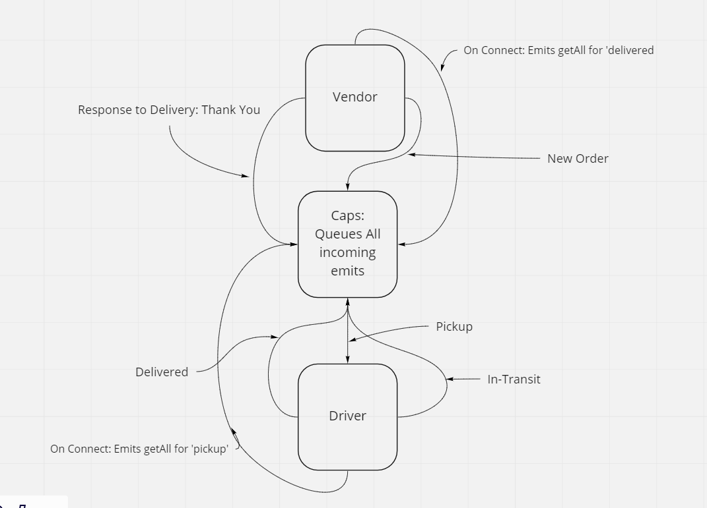

# caps-phase-2-socket-hub

# Lab 13 ==> Messaging Queue

## Deployment Test

Author: Davion Garcia

- [Pull Req 1]()
- Local Testing: Jest

## Setup
- npm i
- dependencies: socket.io socket.io-client

## Running the app

- Waits for socket connections from clients
- emits and fires events based on events emitted of on port 3000

## Tests

- Units tests
- Event handler functions

## UML

- Whiteboard:

